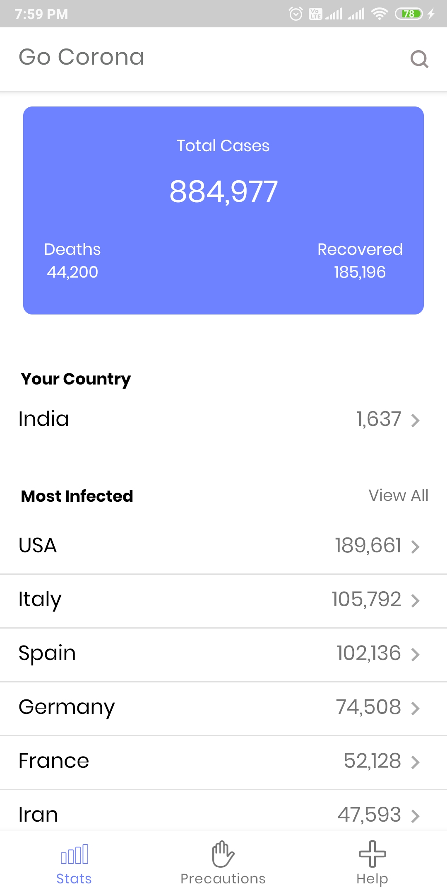
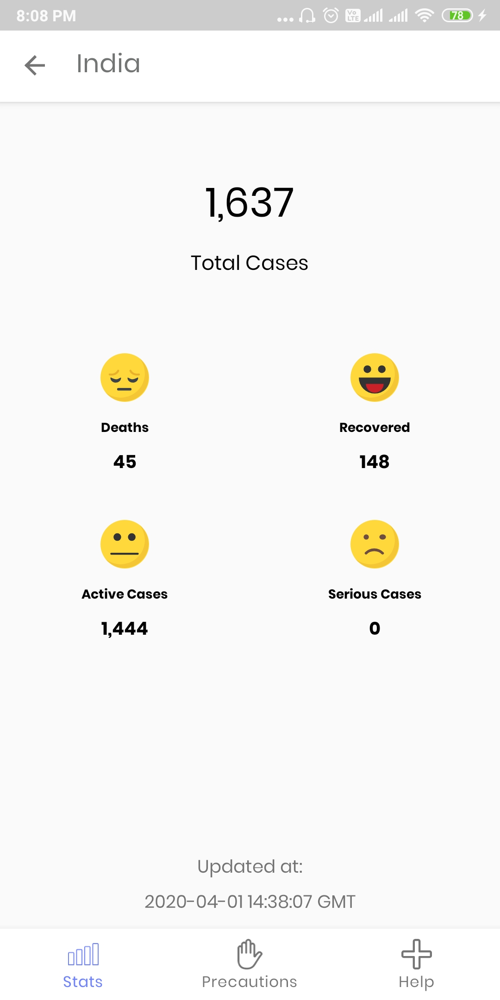
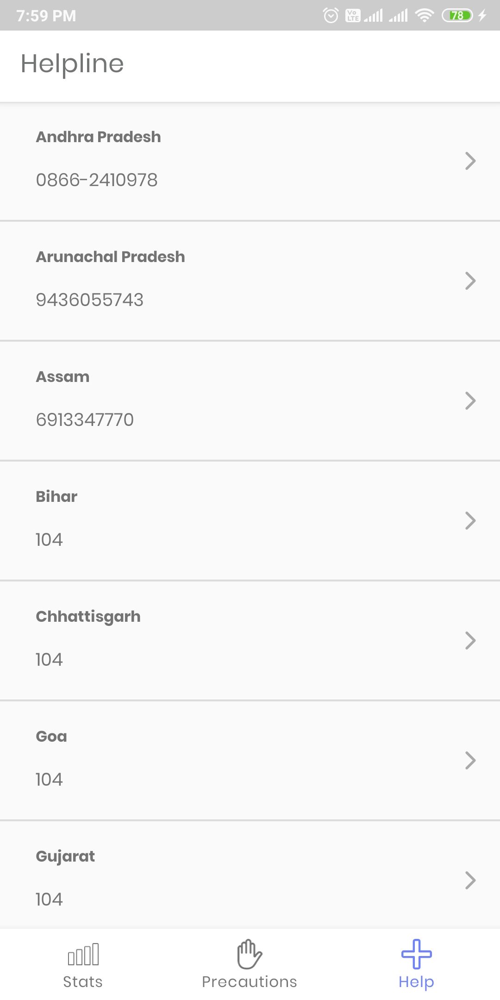

# Go-Corona
Informational app on Coronavirus Pandemic

Track coronavirus cases count around the world taken from https://www.worldometers.info/coronavirus/ and prevention tips from WHO with helpline numbers.

* Track stats for coronavirus cases count around the world.
* Get detailed information country wise.
* Guide and tips on Covid-19
* Helpline numbers available

## Sreenshots:

 
 

## Download

You can download the apk file from [here](https://drive.google.com/open?id=1ueTWZvq6h_KHXeFkET7qh79Ooa3ygcze)

## License & Copyright

Licensed under the [MIT License](LICENSE).
